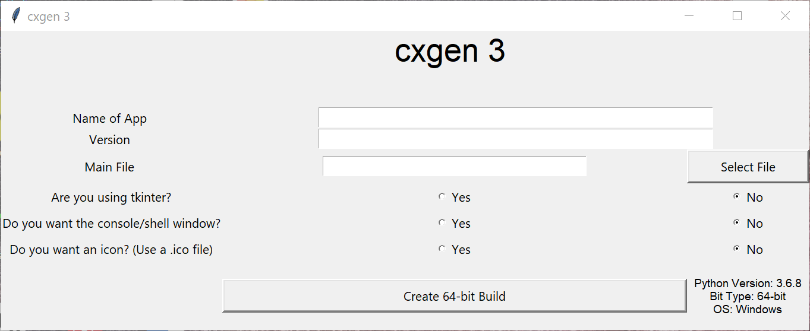

# cxgen

by Armaan Aggarwal

New changes in cxgen 3

- There is now a GUI! (cxgen will now be more focused as a GUI converter)
- cxgen stil uses the 2.0.0 framework, it's  just rebranded as a module: cxgen.Legacy
- Some changes to the framework so that it could support the GUI
- Python 2 is no longer supported - only Python versions 3+ are supported

## How to use cxgen
### To run the GUI: `from cxgen import GUI`

### Legacy
To run the legacy based console application: 

    from cxgen.Legacy import app
    app()

To run the legacy method to generate cx_Freeze setup code:

    from cxgen.Legacy import run
    run()
    
## Download

### Stable Build

- PyPi: https://test.pypi.org/project/cxgen/
or run `pip install cxgen`

- GitHub binaries: https://github.com/armaan115/cxgen/releases

### Download directly from `master` branch (Experimental)
- Run in your command line: `pip install git+https://github.com/armaan115/cxgen`

